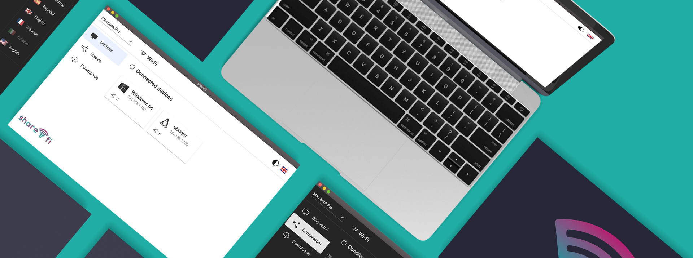

<h1> sharefi-electron </h1>

> The sharefi app allows you to share files and folders through local network. It is fast, secure, free, easy to use and cross platform. You will never go back.

## Supported OS
* Windows 7 or greater
* macOS Catalina or newer
* Linux 64-bit

## Download & Installation
You can download the app directly from [sharefi.app](https://sharefi.app) or build a package from build folder.