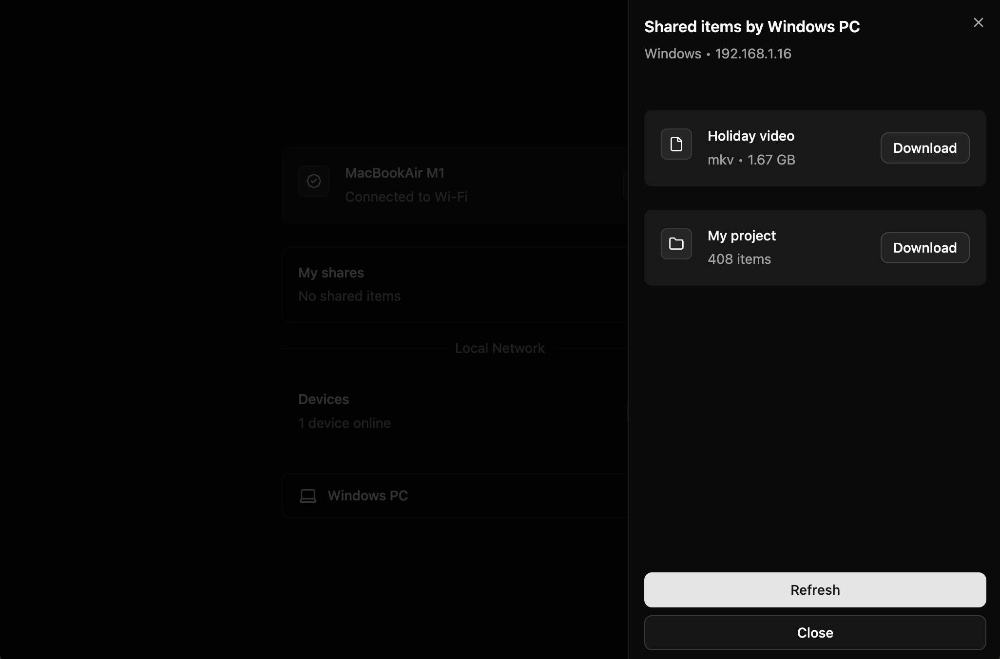

# Sharefi
[](https://github.com/lucafornerone/sharefi-electron/actions?query=workflow%3ACI)
[](https://github.com/lucafornerone/sharefi-electron/actions?query=workflow%3ABuild)

Sharefi is a cross-platform, open-source, and free app to effortlessly share files over your local network.

[Download Sharefi](https://sharefi.app)

<p align="center">
  
</p>

## Purpose

This application addresses the need to transfer files and folders between devices running different operating systems without relying on external hardware storage or email clients.

Built for speed and privacy, Sharefi works entirely offline by routing data directly through your local Wi-Fi or Ethernet via HTTPS-encrypted peer-to-peer connections. Your files never touch the cloud or external servers, ensuring maximum security with zero configuration.

## How it works

This app uses TypeScript for its core architecture and Vue 3 with shadcn-vue for its interface.

It automatically discovers connected devices on the local network using the [network-local-devices](https://npmjs.com/package/network-local-devices) package. File and folder downloads are processed by establishing direct connections between devices, transferring data via raw streams without intermediate infrastructure.

For complete details and visual steps, visit the [website section](https://sharefi.app/#how-it-works).

## Works on
This app has been tested and works correctly on the following operating systems:

|             | Store | Binary |
|-------------|-------|--------|
| **macOS**   |  ✔   |  ✔      |
| **Linux**   |  ✔   |  ✔      |
| **Windows** |  ✔   |  ✔      |

## Take a look
Clone the repository:

```bash
git clone https://github.com/lucafornerone/sharefi-electron
```

Install dependencies:

```bash
npm install
```

Run in dev mode:

```bash
npm run dev
```

## Contribute

I'm happy to welcome any contribution, big or small, feel free to contribute however you prefer! Whether it's code or just suggestions, everything is appreciated.
Please use the GitHub Discussions section to share your ideas or ask questions.

## License

Sharefi is [MIT licensed](LICENSE).